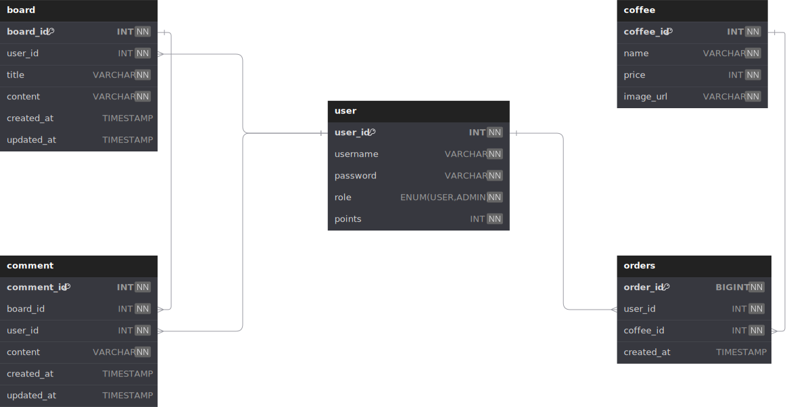

# Tech Spec

## Summary

항해 플러스 8기의 본 과정을 수행하기 이전에, Kotlin + Spring Boot 기술의 사용법을 복습하기 위해 간단한 게시판 형태의 REST API 서버를 구축합니다. 본 사전 과제는 게시글에 대한 CRUD 및 인증/인가 기능을 포함합니다. 본 프로젝트는 과제 검토를 위해 AWS 배포 또한 진행되어야 합니다.

## Goals

- [x] Usecase Diagram 작성
- [x] API 명세서 작성
- [x] ERD 작성
- [x] 게시글 CRUD API 구현
- [x] 회원가입 API 구현
- [x] 로그인 API 구현
- [x] Admin의 회원 권한 부여 기능 구현
- [x] 댓글 CRUD API 구현
- [x] Thymeleaf를 활용해서 기본적인 UI 구현
- [x] 커피 주문 시스템 관련 API 구현
- [x] AWS 배포
- [x] 테스트 케이스 작성

## Plan

### Usecase Diagram

### ERD

### API Specification

<a href="https://nmin1124.gitbook.io/pre-voyage" target="_blank">API 명세서 (by GitBook)</a>

## Milestones

1주차 (2/17 ~ 2/23)

- Draw.io 활용해서 Use Case Diagram 작성
- GitBook 활용해서 API 명세서 작성
- Draw.io 활용해서 ERD 작성

2주차 (2/24 ~ 3/2)

- 회원 인증 및 로그인 기능 구현
- 게시글 CRUD 기능 구현
- 기본적인 Thymeleaf 기반 UI 구현

3주차 (3/3 ~ 3/9)

- Admin의 회원 권한 부여 기능 구현
- 댓글 CRUD API 구현

4주차 (3/10 ~ 3/16)

- AWS 배포

5주차 (3/17 ~ 3/21)

- 커피 주문 시스템 관련 API 구현
- 테스트 케이스 작성

# Deployment

## 배포 프로세스

GitHub Actions를 활용해 EC2로 배포

1. 코드 체크아웃
2. JDK 셋업
3. Gradle 캐시 정리
4. Gradle 테스트
5. Gradle 빌드
6. scp 명령어를 활용해서 빌드된 JAR 파일을 EC2로 복사
7. EC2의 Spring 애플리케이션 재실행

## 참고 사항

- 로컬 환경에서도 간편하게 배포할 수 있도록 `deploy.sh` 파일 마련
  - 스크립트는 GitHub Actions 로직과 유사
  - 환경 변수 값들이 있으므로 git ignore 처리되어 있음

# Thymeleaf / API 분리 작업에 대해

과제 요건 상 UI 구현은 요구되지 않았으나,
구현 사항들을 손쉽게 확인할 수 있도록 가벼운 Thymeleaf UI를 곁들였습니다.
Thymeleaf 기술을 채택할 경우 REST API 방식으로 작동하기에는 어려우므로,
`thymeleaf` 프로필과 함께 `api` 프로필을 추가 구현해서 과제 요건을 맞출 수 있도록 마련했습니다.

**프로필 전환 방법: `application.yml` 파일의 `spring.profiles.actice` 부분에 'thymeleaf' 또는 'api' 입력**

# 과제 질문 답변

	
처음 설계한 API 명세서에 변경사항이 있었나요?

	

		공통 에러 메시지를 구현하거나, 공통 응답 객체를 정의할 때 자잘하게 변경된 부분들이 있었습니다.
		그런데 API 명세서를 미리 적어두었기에 오히려 API를 빠르고 마음 편하게 개발했다는 느낌이 듭니다.
	

 

	
ERD를 먼저 설계한 후 Entity를 개발했을 때 어떤 점이 도움이 되셨나요?

	

		관계도가 명확하게 그려져 있으니 헷갈리거나 실수할 일 없이 빠르게 Entity를 개발할 수 있었습니다.
	

 

	
JWT를 사용하여 인증/인가를 구현 했을 때의 장점은 무엇일까요?

	

		JWT는 대중적으로 많이 활용되는 기술이므로 각 언어별 구현 방안들을 손쉽게 찾아볼 수 있고,
		이에 따라 간편하고 신속하게 인증/인가 기능을 구현할 수 있습니다.
	

 

	
반대로 JWT를 사용한 인증/인가의 한계점은 무엇일까요?

	

		JWT는 stateless로 별도의 저장소 없이도 용이하게 활용할 수 있다는 장점도 있지만,
		토큰이 탈취당할 경우 디코딩이 쉽기 때문에 민감한 정보가 유출될 수 있다는 단점이 있습니다.
		그러므로 세션, 쿠키, 캐시 등 다양한 인증 정보 저장 방식들에 대해서도 잘 알아두고 구현 방안을 마련해두는 것이 좋습니다.
	

 

	
만약 댓글 기능이 있는 블로그에서 댓글이 달려있는 게시글을 삭제하려고 한다면 무슨 문제가 발생할까요? Database 테이블 관점에서 해결방법이 무엇일까요?

	

		부모 엔티티와 자식 엔티티 간의 Cascade를 적절하게 설정해두는 것이 중요합니다. 제 과제 구현 사항에서는 게시글이라는 부모 엔티티에 속한 댓글이라는 자식 엔티티는 모두 삭제되도록 구현했습니다.
		일반적인 일대다의 관계이기 때문에 이렇게 구현했지만,
		만약 다대다의 관계라면 부모 엔티티를 삭제할 때 관계성만 제거하는 식으로 신중하게 영속성을 관리해야 합니다.
	

 

	
IoC / DI 에 대해 간략하게 설명해 주세요!

	

		Inversion of Control은 개발자가 비즈니스 로직 구현에 집중할 수 있도록
		프레임워크가 프로그램의 제어권을 가진다는 개념입니다.
		프로그램이 필요한 시점에 직접 객체들을 가져오기 때문에 '역전의 제어'라고 하는 것입니다. 
		Dependency Injection은 말그대로 의존관계를 주입하는 것입니다.
		Spring의 경우 컨테이너에서 Bean을 통해 객체들을 관리하고, 필요할 때마다 해당 객체들을 주입해 줍니다.
		이런 과정을 통해 객체의 재사용성을 높이고, 객체 간 의존성을 줄여줍니다.
	

## 커피 주문 시스템 문제 해결 전략

### 인기 메뉴 조회 API

- 단위 테스트 작성
  - 기능의 작동 여부를 검증하는 단위 테스트를 작성했습니다.
  - 하지만 캐시 히트 발생 시 캐시에서 데이터를 가져오는 로직을 검증하기 위해서 통합 테스트의 구현이 향후에 필요합니다.
- 동시성 이슈 고려
  - 서비스 레이어에서 트랜잭션을 격리하도록 했습니다.
  - 비관적 락 옵션(`LockModeType.PESSIMISTIC_WRITE`)을 활용해 쓰기 작업 중 읽기 트랜잭션을 수행 할 수 없도록 했습니다.
- 데이터 일관성 고려
  - Redis를 활용해 캐시에서 주간 인기 메뉴를 조회할 수 있도록 구현했습니다.
  - 캐시 미스 발생 시 곧바로 DB 조회 후 캐시를 갱신하도록 하여 데이터의 일관성을 유지하도록 했습니다.
- 다수의 서버에 다수 애플리케이션에서 동작하도록 구현하기
  - 여러 대의 인스턴스를 통해 요청이 들어오더라도 트래픽에 과부하가 오지 않도록 하기 위해 Redis 캐싱 전략을 도입했습니다.
  - 이로써 DB 부하를 줄이고 빠른 응답을 줄 수 있게 되었습니다.
  - 과제 구현은 1개의 EC2 인스턴스로 배포하고 완수했지만, 필요하다면 ECS(EC2) + RDS + ElastiCache 조합으로 유연하게 변경할 수 있을 것입니다.

### 커피 주문 API

- Mock API 전송
	- [mockapi.io](https://mockapi.io/) 서비스를 활용해서 커피 메뉴 주문 시 Mock API를 전송하도록 구현했습니다.
